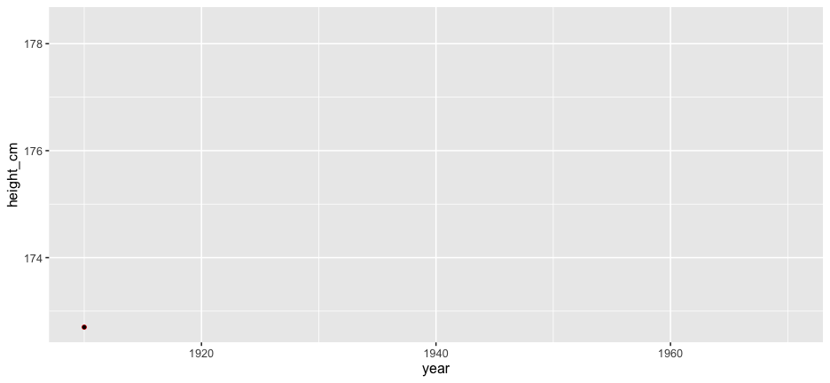
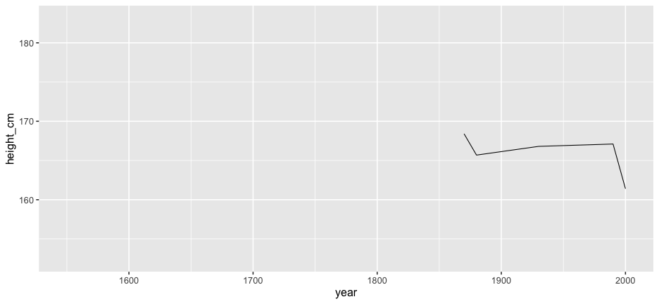
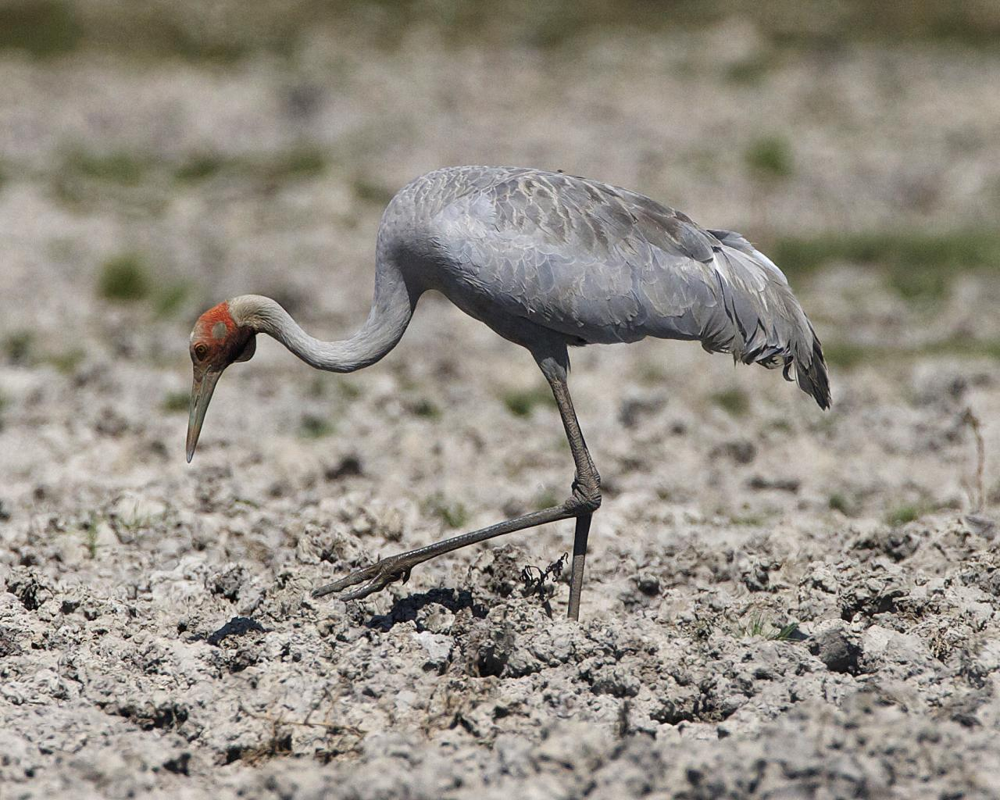
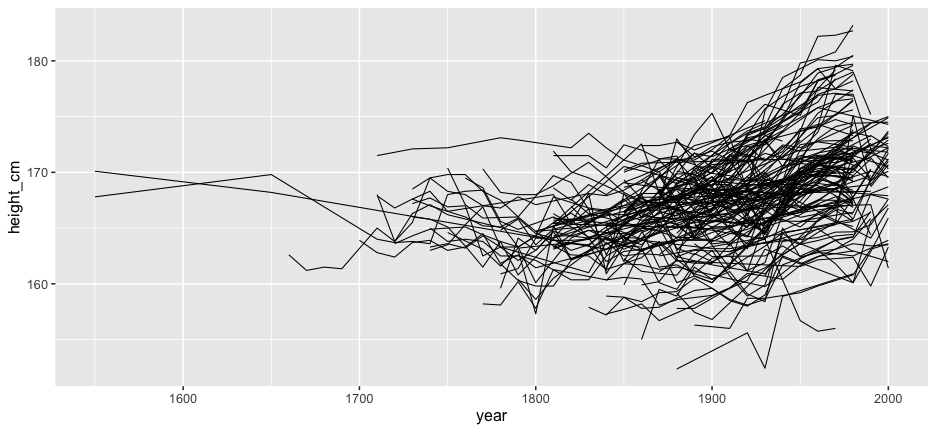
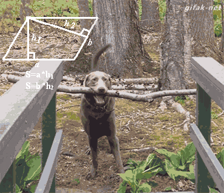

layout: true
<div class="my-footer"><span>bit.ly/njt-wombat • @nj_tierney</span></div> 

```{r setup, include=FALSE}
# options(htmltools.dir.version = FALSE, width = 120)
# NOTE TO SELF: The CSS styles were created in `create-njt-theme.R`
library(modelr)
library(tidyverse)
library(visdat)
library(naniar)
library(gganimate)
library(knitr)
library(ggrepel)
library(lme4)
library(broom)
library(brolgar)
heights <- brolgar::heights
opts_chunk$set(
  fig.path = "figures/",
  cache.path = "cache/",
  fig.align = "center",
  fig.width = 13,
  fig.height = 6,
  fig.retina = 3,
  fig.show = "hold",
  external = TRUE,
  # dev = "svglite",
  # dev.args = list(bg = "transparent"),
  message = FALSE,
  warning = FALSE,
  cache = FALSE,
  echo = FALSE,
  autodep = TRUE
)

mp4_vid <- function(src){
  HTML(
    paste0(
      '<video autoplay>
        <source src="', src, '" type="video/mp4">
      </video>'
    )
  )
}

fig.fullsize <- c(fig.height = 3.5, fig.width = 8, out.width = "150%"
)

as_table <- function(...) knitr::kable(..., format='html', digits = 3)

theme_set(
  theme_grey(base_size = 16) +
  theme(
    legend.position = "bottom",
    plot.background = element_rect(fill = "transparent"),
    legend.background = element_rect(fill = "transparent")
  )
)

heights <- heights %>% 
  add_n_obs() %>% 
  filter(n_obs > 1) %>% 
  select(- n_obs,
         - continent)

example <- heights %>%
  filter(country == "Australia",
         year >= 1910) 

# **ni**ck's **pa**lette
nipa <- list(red = "#c03018",
             orange = "#f0a800",
             green = "#609048",
             purple = "#484878",
             light_purple = "#A3A3BB",
             light_green = "#AFC7A3",
             light_orange = "#F7D37F",
             light_red = "#DF978B",
             pale_purple = "#ECECF1",
             pale_green = "#D7E3D1",
             pale_orange = "#FBE9BF",
             pale_red = "#EFCBC4")

```

```{r fun-heights-appear}
anim_height_appear <- function(){
  anim <- ggplot(heights,
                 aes(x = year,
                     y = height_cm,
                     group = country)) + 
    geom_line() + 
    transition_manual(country, cumulative = TRUE) + 
    ease_aes("exponential")
  animate(anim, fps = 24)
}
```

```{r fun-height-reveal}
anim_height_reveal <- function(){
p <- ggplot(example, 
            aes(x = year, 
                y = height_cm)) + 
  geom_line() + 
  geom_point(colour = "red", size = 2) + 
  geom_point(aes(group = seq_along(year))) + 
  transition_reveal(year) + 
  ease_aes('cubic-in-out')
animate(p, fps = 24, duration = 5)
}
```

```{r fun-gg-heights}
gg_heights <- function(data){  
  ggplot(data, 
         aes(x = year,
             y = height_cm,
             group = country)) + 
  geom_line()
}
```

---

## Background: Undergraduate

.pull-left.large[
Undergraduate in Psychology

- Statistics
- Experiment Design
- Cognitive Theory
- Neurology
- Humans
]

.pull-right[
```{r psych, out.width = "80%"}

```
]

---

## Background: PhD

.pull-left.large[
- "Ah, statistics, everything is black and white!
- "There's always an answer"
- "data in, answer out"
]


.pull-right[
```{r bw-mountains}

```

]

???

I started a PhD in statistics at QUT, under (now distinguished) Professor Kerrie Mengersen, Looking at people's health over time.

- There were several things that I noticed:
  - There were equations, but not as many clear-cut, black and white answers
  
---

## Journey of Analytic Discovery

- map

---

## Background: PhD

.pull-left.large[

- Data is really messy
- Missing values are frustrating
- How to Explore data?

]

.pull-right[
```{r explorer}

```

]

---

## (My personal) motivation

.large[
A lot of research in new statistical methods - imputation, inference, prediction
]

--

.large[
Not much research on how we explore our data, and the methods that we use to do this.
]

---

## (My personal) motivation

.pull-left[
```{r bw-bridge}

```

]

.pull-right.large[
  > Focus on building a bridge across a river. Less focus on **how** it is built, and the **tools** used.
]

???

- I became very interested in how we explore our data - exploratory data analysis.

---
class: inverse, middle, center

.huge[
My research:

Design and improve tools for (exploratory) data analysis
]

---

# EDA: Why it's worth it

--

```{r dino-saurus}
include_graphics("gifs/dino-saurus.gif")
```

-- From ["Same Stats, Different Graphs: Generating Datasets with Varied Appearance and Identical Statistics through Simulated Annealing"](https://www.autodeskresearch.com/publications/samestats)

---
class: inverse, middle, center


```{r learn-more, echo = FALSE, out.width = "70%"}

```

.pull-left[
.center[
.hugew[
[visdat.njtierney.com](https://visdat.njtierney.com)
]
]
]

.pull-right[
.center[
.hugew[
[naniar.njtierney.com](https://naniar.njtierney.com)
]
]
]

---
class: middle, center, inverse

.vhuge[Current work:]

.huge[
How to explore longitudinal data effectively
]

---
class: inverse, middle,

# What is longitudinal data?

.huge[
> Something observed sequentially over time
]


---

# What is longitudinal data?

.large[
```{r example-1}
as_table(example[1,])
```
]

---

# What is longitudinal data?

.large[
```{r example-2}
as_table(example[1:2,])
```
]

---

# What is longitudinal data?

.large[
```{r example-3}
as_table(example[1:3,])
```
]

---

# What is longitudinal data?

.large[
```{r example-4}
as_table(example[1:4,])
```
]

---

```{r reveal-height, fig.height = 3.5, fig.width = 8, out.width = "150%"}
# anim_height_reveal()

```

---

```{r gg-example, fig.height = 3.5, fig.width = 8, out.width = "150%"}
ggplot(example,
       aes(x = year,
           y = height_cm)) + 
  geom_point() + 
  geom_line()
```

---

# All of Australia

```{r gg-all-australia}
heights %>%
  filter(country %in% c("Australia")) %>%
  gg_heights() + 
  lims(x = range(heights$year),
       y = range(heights$height_cm))

```


---

# ...And New Zealand

```{r gg-show-a-few-countries}
heights %>%
  filter(country %in% c("Australia",
                        "New Zealand")) %>%
gg_heights() + 
  lims(x = range(heights$year),
       y = range(heights$height_cm))
```


---

# ... And Afghanistan and Albania

```{r sample-more-heights}
heights %>%
  filter(country %in% c("Australia",
                        "Afghanistan",
                        "Albania",
                        "New Zealand")) %>%
gg_heights() + 
  lims(x = range(heights$year),
       y = range(heights$height_cm))
```

---

# And the rest?

```{r animate-all-data}
# anim_height_appear()

```

---

# And the rest?

```{r gg-show-all}
gg_heights(heights)
```

---

```{r noodle-explode-gif, out.width = "50%"}

```


---

# Problems:

.pull-left.large[
- Overplotting
- We don't see the individuals
- We could look at 144 individual plots, but this doesn't help.
]

.pull-right[
```{r gg-heights-heights-again}
gg_heights(heights)
```
]

---

# Does transparency help?

```{r gg-show-all-w-alpha}
ggplot(heights,
       aes(x = year,
           y = height_cm,
           group = country)) + 
  geom_line(alpha = 0.2) 
```

---

# Does transparency + a model help?

```{r gg-show-all-w-model}
gg_height_lm <- 
ggplot(heights,
       aes(x = year,
           y = height_cm)) + 
  geom_line(alpha = 0.2,
            aes(group = country)) + 
  geom_smooth(method = "lm")

gg_height_lm
```

???

- This helps reduce the overplotting
- We only get the overall average. We dont get the rest of the information

---

# This is still useful

```{r show-height-lm}
gg_height_lm
```

???

- We get information on what the average is, and how that behaves
- But we don't get the full story
- So, it depends on your need. If you have a designed experiment, where you stated that you would run some analysis, then you are doing this.
- ... But even then, wouldn't you rather _explore_ the data?
- Who fits the models well / worst / best?

---


# But we forget about the **individuals**

```{r heights-dec}
heights_dec <- heights %>%
  features(height_cm, feat_five_num) %>%
  filter(max == max(max)) %>%
  left_join(heights, by = "country")

gg_height_highlight <- 
ggplot(heights,
       aes(x = year,
           y = height_cm)) + 
  geom_line(alpha = 0.2,
            aes(group = country)) + 
  geom_smooth(method = "lm") +
  geom_line(data = heights_dec,
            aes(group = country),
            colour = nipa$orange,
            alpha = 1,
            size = 3) + 
  geom_label_repel(data = filter(heights_dec, year == max(year)),
                   aes(label = country,
                       colour = nipa$orange),
                   nudge_x = -1,
                   size = 10) + 
  theme(legend.position = "none")

gg_height_highlight
```

???

- The model might make some good overall predictions
- But it can be really _ill suited_ for some individual
- Exploring this is somewhat clumsy - we need another way to explore


---

# How do we get the most out of this plot?


```{r gg-height-highlight-2}
gg_height_highlight
```

---

# How do I even get started?!


```{r gg-height-highlight-3}
gg_height_highlight
```

---
class: inverse, middle 

.large[
Problem #1: How do I look at **some** of the data?
]

--

.large[
Problem #2: How do I find **interesting** observations?
]

--

.large[
Problem #3: How do I **understand** my statistical model
]

---

# Introducing `brolgar`: brolgar.njtierney.com

.pull-left.large[
* **br**owsing
* **o**ver
* **l**ongitudinal data 
* **g**raphically, and
* **a**nalytically, in
* **r**
]

.pull-right[
```{r show-brolgar}

```
]

???

* It's a crane, it fishes, and it's a native Australian bird


---

```{r gg-remind-spaghetti, fig.width = 8, fig.height = 4, out.width = "200%"}
gg_spag <- 
gg_heights(heights) + 
  labs(title = "Remember, this is a spaghetti plot",
       subtitle = "This plot is the problem we are working with")

gg_spag
```


---
class: inverse, middle, center

# What is longitudinal data?

.vlarge[
> Something observed sequentially over time
]
---
class: inverse, middle, center

# What is longitudinal data?


.vlarge[
> ~~Something~~ **Anything that is** observed sequentially over time **is a time series**
]

---
class: inverse, middle, center

# ~~What is longitudinal data?~~ Longitudinal data is a time series.


.vlarge[
> ~~Something~~ **Anything that is** observed sequentially over time **is a time series**
]

.large[
[-- Rob Hyndman and George Athanasopolous,
Forecasting: Principles and Practice](https://otexts.com/fpp2/data-methods.html)
]

---

# Longitudinal data as a time series 


```{r show-tsibble-creation, echo = TRUE, eval = FALSE}
heights <- as_tsibble(heights,
                      index = year,
                      key = country,
                      regular = FALSE) #<<
```

1. **index**: Your time variable
2. **key**: Variable(s) defining individual groups (or series)

`1. +  2.` determine distinct rows in a tsibble.

(From Earo Wang's talk: [Melt the clock](https://slides.earo.me/rstudioconf19/#8))

---

# Longitudinal data as a time series 

## Key Concepts:

.large[
Record important time series information once, and use it many times in other places

- We add information about **index** + **key**:
  - Index = Year
  - Key = Country
]
---

.large[
```{r show-heights}
print(heights, n = 6)
```
]

---
class: inverse, middle, center

.huge[
Remember: 

**key**  = variable(s) defining individual groups (or series)
]

---

# Problem #1: How do I look at **some** of the data?

--

.pull-left.large[
Look at only a sample of the data:
]

.pull-right.large[
```{r ggplot-sample-keys}
heights_sample <- sample_n_keys(heights, 5)
gg_sample_keys <- gg_heights(heights_sample)

gg_sample_keys
```
]

---

# Sample `n` rows with `sample_n()`

```{r create-sample-n, echo = FALSE}
set.seed(2019-11-21)
heights_sample_n <- heights %>% sample_n(5)
```


--

```{r show-sample-n, echo = TRUE, eval = FALSE}
heights %>% sample_n(5)
```

--

```{r print-sample-n}
heights_sample_n
```


---

# Sample `n` rows with `sample_n()`

```{r plot-sample-n}
heights_sample_n %>% gg_heights() + geom_point()
```


---

# Sample `n` rows with `sample_n()`

```{r show-sample-n-again}
heights_sample_n
```

--

.large[
... sampling needs to select not random rows of the data, but the **keys - the countries**.
]

---


# `sample_n_keys()` to sample ... **keys**

```{r show-sample-keys, echo = TRUE, eval = FALSE}
sample_n_keys(heights, 5)
```

```{r print-show-sample-keys}
heights_sample %>% print(n = 6)
```

---

# `sample_n_keys()` to sample ... **keys**

```{r ggplot-sample-keys-2}
gg_sample_keys
```

---

# Problem #1: How do I look at **some** of the data?


.large.left[
~~Look at subsamples~~
]

.large.right[
Sample **keys**
]

--

.large.left[
Look at **many** subsamples
]

--

.large.right[
**?**
]

---

# Look at many subsamples

```{r all-heights}
gg_heights(heights)
```

---

# Look at many subsamples

```{r all-heights-samples}
gg_sample_keys
```

---

# Look at many subsamples

```{r heights-strata}
gg_heights(heights) + 
  facet_sample()
```

---

# **How** to look at many subsamples

.large[
- How many facets to look at? (2, 4, ... 16?)
]

--

.large[
- How many keys per facets?
  - 144 keys into 16 facets = 9 each
]

--

.large[
- Randomly pick 16 groups of size 9.
]

--

.large[
- This might not look like much extra work, but it hits the
**distraction threshold** quite quickly.
]

---

<iframe width="1020" height="630" src="https://www.youtube.com/embed/AbSehcT19u0" frameborder="0" allow="accelerometer; autoplay; encrypted-media; gyroscope; picture-in-picture" allowfullscreen></iframe>

---

# Distraction threshold (time to rabbit hole)

--

.large[

(Something I made up)
]

--

.large[
> If you have to solve 3+ substantial smaller problems in order to solve a larger problem, your focus shifts from the current goal to something else. 
You are distracted.

]

???

- Task one

- Task one being overshadowed slightly by minor task 1
- Task one being overshadowed slightly by minor task 2
- Task one being overshadowed slightly by minor task 3

---

# Distraction threshold (time to rabbit hole)

**I want to look at many subsamples of the data** 

--

How many keys are there?

--

How many facets do I want to look at

--

How many keys per facet should I look at

--

How do I ensure there are the same number of keys per plot

--

What is `rep`, `rep.int`, and `rep_len`?

--

Do I want `length.out` or `times`?


---

# Avoiding the rabbit hole

--

.large[
We can blame ourselves when we are distracted for not being better.
]

--

.large[
It's not that we should be better, rather **with better tools we could be more efficient**. 
]

--

.large[
We need to make things **as easy as reasonable**, with the least amount of distraction.
]


---

# Removing the distraction threshold means asking the most relevant question

--

.large[
> How many plots do I want to look at?
]

--

```{r show-facet-sample, echo = TRUE, eval = FALSE}
heights_plot +
  facet_sample(
    n_per_facet = 3, #<<
    n_facets = 9 #<<
  )
```

---

```{r show-facet-sample-print, echo = FALSE, out.width = "100%"}
gg_heights(heights) + 
  facet_sample(
    n_per_facet = 3, #<<
    n_facets = 9 #<<
  )
```

---

# `facet_sample()`: See more individuals

```{r gg-facet-sample-all, echo = TRUE, out.width = "60%"}
ggplot(heights, aes(x = year, 
                    y = height_cm, 
                    group = country)) + 
  geom_line() 
```

---

# `facet_sample()`: See more individuals

```{r gg-facet-sample, echo = TRUE, eval = FALSE}
ggplot(heights,
       aes(x = year,
             y = height_cm,
             group = country)) + 
  geom_line() + 
  facet_sample() #<<
```

---

# `facet_sample()`: See more individuals

```{r print-gg-facet-sample, ref.label='gg-facet-sample'}
```

---

# `facet_strata()`: See all individuals

```{r gg-facet-strata, echo = TRUE, eval = FALSE}
ggplot(heights,
       aes(x = year,
             y = height_cm,
             group = country)) + 
  geom_line() + 
  facet_strata() #<<
```

---

# `facet_strata()`: See all individuals

```{r print-gg-facet-strata, ref.label='gg-facet-strata'}
```

---

## Can we re-order these facets in a meaningful way?

```{r print-gg-facet-strata-again, ref.label='gg-facet-strata'}
```

???

In asking these questions we can solve something else interesting

---

## `facet_strata(along = -year)`: see all individuals **along** some variable

```{r gg-facet-strata-along, echo = TRUE, eval = FALSE}
ggplot(heights,
       aes(x = year,
             y = height_cm,
             group = country)) + 
  geom_line() + 
  facet_strata(along = -year) #<<
```

---

## `facet_strata(along = -year)`: see all individuals **along** some variable

```{r print-gg-facet-strata-along, ref.label = "gg-facet-strata-along"}
```


---

# Focus on answering relevant questions instead of the minutae:

.pull-left[
"How many lines per facet"

"How many facets?"

```{r demo-facet-sample, eval = FALSE, echo = TRUE}
ggplot + 
  facet_sample(
    n_per_facet = 10, #<<
    n_facets = 12 #<<
    ) 
```

]

--

.pull-right[
"How many facets to shove all the data in?"

```{r demo-facet-strata, eval = FALSE, echo = TRUE}
ggplot + 
  facet_strata(
    n_strata = 10, #<<
    ) 
```

]

---

# `facet_strata()` & `facet_sample()` Under the hood

.large[
`r icon::fa_industry()` using `sample_n_keys()` & `stratify_keys()`
]

--

.large[
You can still get at data and do manipulations
]

---

## Problem #1: How do I look at some of the data?

--

.left-code.large[

`as_tsibble()`

`sample_n_keys()`

`facet_sample()`

`facet_strata()`

]

--


.right-plot.large[

Store useful information

View subsamples of data

View many subsamples

View all subsamples

]


---

## ~~Problem #1: How do I look at some of the data?~~

.left-code.large[

`as_tsibble()`

`sample_n_keys()`

`facet_sample()`

`facet_strata()`

]

.right-plot.large[

Store useful information

View subsamples of data

View many subsamples

View all subsamples

]


---

## Problem #2: How do I find **interesting** observations?

```{r quite-interesting-obs}
ggplot(heights,
       aes(x = year,
             y = height_cm,
             group = country)) + 
  geom_line()
```

---

## Problem #2: How do I find **interesting** observations?

```{r quite-interesting-obs-2}
gg_height_highlight
```

---
class: inverse, center, middle

.huge[
**Define** interesting?
]


---

## Identify features: summarise down to one observation

```{r anim-line-flat, cache = TRUE}
set.seed(2019-09-30-0012)

heights_feature <- heights %>%
  features(height_cm, feat_spread) 

heights_feature_flat <- heights_feature %>%
  left_join(heights, by = "country") %>%
  group_by(country) %>%
  mutate(height_cm = max(height_cm))

heights_feature_flat_var <- heights_feature %>%
  left_join(heights, by = "country") %>%
  group_by(country) %>%
  mutate(height_cm = var(height_cm))

heights_flat_combine <- bind_rows(spaghetti = as_tibble(heights),
                                  summary = heights_feature_flat,
                                  .id = "state") %>%
  mutate(state = factor(state, levels = c("spaghetti", 
                                          "summary")))

heights_flat_combine_var <- bind_rows(spaghetti = as_tibble(heights),
                                      summary = heights_feature_flat_var,
                                      .id = "state") %>%
  mutate(state = factor(state, levels = c("spaghetti", 
                                          "summary")))
```


```{r anim-line-flat-max, cache = TRUE}
# library(gganimate)
# anim_flat <- ggplot(heights_flat_combine,
#        aes(x = year,
#            y = height_cm,
#            group = country)) + 
#   geom_line() +
#   transition_states(state) + 
#   ease_aes("cubic-in-out")
# 
# animate(anim_flat, nframes = 24, duration = 6)

```


---

## Identify features: summarise down to one observation

```{r show-line-range-point}
heights_feature_flat_point <- heights_feature_flat %>%
  filter(year == max(year))

gg_id_features_line_point <- 
ggplot(heights_feature_flat,
       aes(x = year,
           y = height_cm,
           group = country)) + 
  geom_line() + 
  geom_point(data = heights_feature_flat_point,
             aes(x = year,
                 y = height_cm)) +
  lims(y = range(heights$height_cm))

gg_id_features_line_point
```


---

## Identify features: summarise down to one observation

```{r gg-show-point}

gg_id_just_points <-
ggplot(heights_feature_flat_point,
       aes(x = year,
           y = height_cm)) +
  geom_point() +
  lims(y = range(heights$height_cm),
       x = range(heights$year))

gg_id_just_points
```

---

## Identify important features and decide how to filter 

```{r gg-show-red-points}
min_max <- heights_feature_flat_point %>%
  ungroup() %>%
  filter(near_quantile(height_cm, c(0,1), 0.01)) 

gg_id_features_red_dots <- 
  ggplot(heights_feature_flat_point,
         aes(x = year,
             y = height_cm)) +
  geom_point(data = min_max,
             colour = "#c03018",
             size = 6) +
  geom_point() +
  lims(y = range(heights$height_cm),
       x = range(heights$year))

gg_id_features_red_dots
```

---

## Identify important features and decide how to filter 

```{r gg-just-red-points}
gg_id_features_red_dots_only <- 
ggplot(min_max,
       aes(x = year,
           y = height_cm,
           group = country)) + 
  geom_point(colour = nipa[["red"]],
             size = 6) + 
  geom_point() + 
  lims(y = range(heights$height_cm),
       x = range(heights$year))

gg_id_features_red_dots_only
```


---

## Join this feature back to the data

```{r gg-join-red}
min_max_joined <- heights %>% filter(country %in% min_max$country)

gg_join_red <- 
ggplot(min_max,
       aes(x = year,
           y = height_cm,
           group = country)) + 
  geom_point(colour = nipa[["red"]],
             size = 6) + 
  geom_point() + 
  geom_line(data = min_max_joined,
            colour = nipa[["red"]],
            size = 2) + 
  lims(y = range(heights$height_cm),
       x = range(heights$year))

gg_join_red
```

---

## Join this feature back to the data

```{r gg-join-red-show-all}
gg_join_red_all <- 
ggplot(min_max,
       aes(x = year,
           y = height_cm,
           group = country)) + 
  geom_point(colour = nipa[["red"]],
             size = 6) + 
  geom_point() + 
  geom_line(data = heights,
            aes(x = year,
                y = height_cm),
            alpha = 0.3) +
  geom_line(data = min_max_joined,
            colour = nipa[["red"]],
            size = 2) + 
  lims(y = range(heights$height_cm),
       x = range(heights$year))

gg_join_red_all
```

---

## `r emo::ji("tada")` Countries with smallest and largest max height

```{r show-red-all-again}
gg_join_red_all + 
  geom_label_repel(colour = nipa[["red"]],
             aes(label = country),
             size = 10,
             nudge_x = -10)
```

---
class: inverse, middle, cetner

.vhuge[
Let's see that **one more time**, but with the data
]

---

## Identify features: summarise down to one observation

```{r print-heights-again}
heights
```

---

## Identify features: summarise down to one observation

```{r create-feature-five-1}
heights_five <- heights %>%
  features(height_cm, #<<
           feat_five_num) #<<
```

```{r print-heights-for-features}
heights_five
```

---

## Identify important features and decide how to filter 

```{r jus-obs, echo = TRUE}
heights_five %>% 
  filter(max == max(max) | max == min(max))
```

---

## Join summaries back to data

```{r show-code, echo = TRUE}
heights_five %>% 
  filter(max == max(max) | max == min(max)) %>% 
  left_join(heights, by = "country")
```

---

```{r show-doggo, out.width = "70%"}

```

---

## Identify features: one per **key** 

```{r show-features, echo = TRUE, eval = FALSE}
heights %>%
  features(height_cm, #<<
           feat_five_num) #<<
```
 
```{r create-feature-five}
heights_five <- heights %>%
  features(height_cm, #<<
           feat_five_num) #<<

print(heights_five, n = 6)
```

---

## features: Summaries that are **aware of data structure** 

--

```{r show-features-2, echo = TRUE, eval = FALSE}
heights %>%
  features(height_cm, #<< # variable we want to summarise
           feat_five_num) #<< # feature to calculate
```

--

```{r create-feature-five-2}
heights_five <- heights %>%
  features(height_cm, #<<
           feat_five_num) #<<

print(heights_five, n = 6)
```

---
class: middle, center
# Other available `features()` in `brolgar` 

---

## What is the range of the data? `feat_ranges`

```{r features-feat-ranges, echo = TRUE}
heights %>%
  features(height_cm, feat_ranges)
```

---

## Does it only increase or decrease? `feat_monotonic`

```{r features-feat-monotonic, echo = TRUE}
heights %>%
  features(height_cm, feat_monotonic)
```

---

## What is the spread of my data? `feat_spread`

```{r features-feat-spread, echo = TRUE}
heights %>%
  features(height_cm, feat_spread)
```

---

## features: MANY more features in `feasts` 

.large[
Such as:

- `feat_acf`: autocorrelation-based features
- `feat_stl`: STL (Seasonal, Trend, and Remainder by LOESS) decomposition
]


---

## features: what is `feat_five_num?` 

--

```{r show-feat-five-num, echo = TRUE}
feat_five_num
```


---

## features: what is `feat_five_num?` 

.huge[
[Create your own features (from brolgar.njtierney.com)](http://brolgar.njtierney.com/articles/finding-features.html#creating-your-own-features)
]


---

# ~~Problem #1: How do I look at **some** of the data?~~

--

# Problem #2: How do I find **interesting** observations?

--

.large[
- Decide what features are interesting
- Summarise down to one observation
- Decide how to filter 
- Join this feature back to the data
]

---

# ~~Problem #1: How do I look at **some** of the data?~~

# ~~Problem #2: How do I find **interesting** observations?~~

--

# Problem #3: How do I **understand** my statistical model


---

# Problem #3: How do I **understand** my statistical model

.medium[
Let's fit a simple mixed effects model to the data

Fixed effect of year + Random intercept for country
]

```{r fit-lme4, echo = TRUE}
heights_fit <- lmer(height_cm ~ year + (1|country), heights)

heights_aug <- heights %>%
  add_predictions(heights_fit, var = "pred") %>%
  add_residuals(heights_fit, var = "res")
```

---

# Problem #3: How do I **understand** my statistical model


```{r lme4-augment}
heights_aug
```

---

# Problem #3: How do I **understand** my statistical model

```{r fits}
gg_heights_fit <- 
ggplot(heights_aug,
       aes(x = year,
           y = pred,
           group = country)) + 
  geom_line() 

gg_heights_fit
```

---

## Look at subsamples?

--

```{r subsamples-heights}
heights_aug %>% 
  sample_n_keys(5) %>% 
ggplot(aes(x = year,
           y = pred,
           group = country)) + 
  geom_line() 
```


---

## Look at **many** subsamples?

--

```{r heights-fit-facet-sample, echo = TRUE, out.width = "70%"}
gg_heights_fit + facet_sample()
```

---

## Look at **all** subsamples?

```{r heights-fit-facet-strata, echo = TRUE, out.width = "70%"}
gg_heights_fit + facet_strata()
```

---

## Look at **all** subsamples **along** residuals?

```{r heights-fit-facet-strata-res, echo = TRUE, out.width = "70%"}
gg_heights_fit + facet_strata(along = -res)
```

---

# Look at the predictions with the data?

```{r small-sample, eval = FALSE, echo = TRUE}
set.seed(2019-11-13)
heights_sample <- 
heights_aug %>%
  sample_n_keys(size = 9) %>% #<< sample the data
  ggplot(aes(x = year,
             y = pred,
             group = country)) + 
  geom_line() +
  facet_wrap(~country)

heights_sample
```  

---

# Look at the predictions with the data?

```{r small-sample-out, ref.label = 'small-sample', echo = FALSE, out.width = "100%"}

```

---

# Look at the predictions with the data?

```{r small-sample-add-real-data, echo = TRUE, out.width = "70%"}
heights_sample + geom_point(aes(y = height_cm))
```  

---

# What if we grabbed a sample of those who have the best, middle, and worst residuals? 

--

```{r summary-residuals, echo = TRUE}
summary(heights_aug$res)
```

--

.large[
Which countries are **nearest** to these statistics?
]

---

# use `keys_near()`

.pull-left[
```{r keys-near, echo = TRUE}
heights_aug %>%
  keys_near(key = country,
            var = res)
```
]

.pull-right[
```{r save-keys-near}
heights_near <- heights_aug %>%
  keys_near(key = country,
            var = res)
```

> This shows us the keys that closely match the five number summary. 

]

---

## Show data by joining it with residuals, to explore spread

```{r plot-join-aug}
library(stickylabeller)

heights_near_aug <- left_join(heights_near,
          heights_aug,
          by = "country")

gg_heights_near <-
ggplot(heights_near_aug,
       aes(x = year,
             y = pred,
             group = country,
             colour = country)) + 
  geom_line() + 
  geom_point(aes(y = height_cm)) + 
  facet_wrap(~stat + country,
             labeller = label_glue("Country: {country} \nNearest to {stat} residual")) + 
  theme(legend.position = "none")

gg_heights_near
```  

---

# Take homes

## Problem #1: How do I look at **some** of the data?


.large[
1. Longitudinal data is a time series
2. Specify structure once, get a free lunch.
3. Look at as much of the raw data as possible 
4. Use `facet_sample()` / `facet_strata()` to look at data
]

---

# Take homes

## Problem #2: How do I find **interesting** observations?

.large[
1. Decide what features are interesting
2. Summarise down to one observation
3. Decide how to filter
4. Join this feature back to the data
]

---

# Take homes

## Problem #3: How do I **understand** my statistical model

.large[
1. Look at (one, more or all!) subsamples
1. Arrange subsamples
1. Find keys near some summary 
1. Join keys to data to explore representatives
]

---

# Thanks

.large[
- Di Cook
- Tania Prvan
- Stuart Lee
- Mitchell O'Hara Wild
- Earo Wang
- Rob Hyndman
- Miles McBain
- Monash University
]

---

# Resources

.large[
- [feasts](http://feasts.tidyverts.org/)
- [tsibble](http://tsibble.tidyverts.org/)
- [Time series graphics using feasts](https://robjhyndman.com/hyndsight/feasts/)
- [Feature-based time series analysis](https://robjhyndman.com/hyndsight/fbtsa/)
]

---

# Colophon

.large[
- Slides made using [xaringan](https://github.com/yihui/xaringan)
- Extended with [xaringanthemer](https://github.com/gadenbuie/xaringanthemer)
- Colours taken + modified from [lorikeet theme from ochRe](https://github.com/ropenscilabs/ochRe)
- Header font is **Josefin Sans**
- Body text font is **Montserrat**
- Code font is **Fira Mono**
]

---

# Learning more

.large[
`r icon::fa_box_open() ` [brolgar.njtierney.com](http://brolgar.njtierney.com/)

`r icon::fa('link')` [bit.ly/njt-wombat](https://bit.ly/njt-wombat)

`r icon::fa_twitter()` nj_tierney

`r icon::fa_github()` njtierney

`r icon::fa_paper_plane()` nicholas.tierney@gmail.com

]


---

.vhuge[
**End.**
]

???

- now let's go through these same principles:
  - Sample the fits
  - Many samples of the fits
  - Explore the residuals
  - Find the best, worst, middle of the ground residuals
  - follow the "gliding" process again.
  
